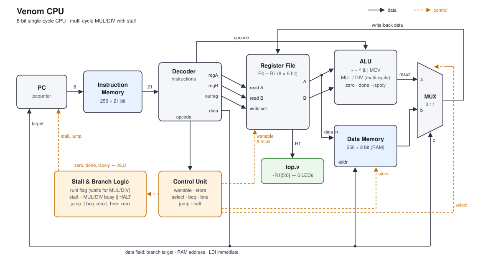

# Venom Extended

Venom Extended is the pipelined version of Venom, a simple 8-bit processor written from scratch in Verilog. It is a learning project: the goal is to understand how a CPU works by designing every part of it by hand. It is developed with Gowin EDA on a Sipeed Tang Nano 20K, but the CPU core itself is plain Verilog and can be used on any FPGA.

> **Branches:** `main` holds the original single-cycle Venom. `extended` (this branch) holds Venom Extended, which adds a 4-stage pipeline.

## Overview

- 8-bit datapath
- 8 general-purpose 8-bit registers (R0–R7)
- Fixed-length 21-bit instruction word, 16 instructions
- Separate instruction memory and data memory (256 entries each)
- 4-stage pipeline (Fetch, Decode, Execute, Write-back) with two-level forwarding and branch flush
- Multiply and divide are multi-cycle and stall the pipeline until they finish
- Conditional (BEQ, BNE) and unconditional (JUMP) branches
- The value of R1 is exposed as an output, and the board wrapper shows it on the LEDs
- The board wrapper divides the 27 MHz clock down to 1 Hz, so you can watch the program run step by step

## Getting started

### Requirements

- [Gowin EDA](https://www.gowinsemi.com/en/support/download_eda/) (the Education edition is enough) to build for Tang Nano 20K
- Optional: [Icarus Verilog](https://steveicarus.github.io/iverilog/) and [GTKWave](https://gtkwave.sourceforge.net/) for simulation

```
git clone <repository-url>
cd venom
```

### Running on Tang Nano 20K

1. Open `venom.gprj` in Gowin EDA. The project is already set up for the Tang Nano 20K chip (`GW2AR-LV18QN88C8/I7`), and `src/venom.cst` contains the pin assignments.
2. Set the top module. This setting is stored in Gowin's local files, so it is not included in the repository:
   **Project → Configuration → Synthesize → Top Module/Entity** → `top`
   (the module name, not the file name `top.v`).
3. Write a program into `src/instructionmemory.v` (see [Writing programs](#writing-programs)). The repository ships with a prime number finder (see [Examples](#examples)).
4. Click **Run All** to synthesize and place & route.
5. Load the bitstream (`impl/pnr/venom.fs`) onto the board with Gowin Programmer, or with [openFPGALoader](https://github.com/trabucayre/openFPGALoader):
   ```
   openFPGALoader -b tangnano20k impl/pnr/venom.fs
   ```

**What you will see:** the six onboard LEDs show the lower 6 bits of R1 in binary. LED0 is the least significant bit. The onboard LEDs are active-low, so `top.v` inverts the value, and a lit LED means `1`.

**Clock:** `top.v` divides the 27 MHz board clock down to about 260 kHz, which suits the prime finder (one prime per second). To watch a program run instruction by instruction, slow it down to 1 Hz by changing the limit `24'd51` in `top.v` to `24'd13499999`. The Fibonacci and counter examples below are meant for 1 Hz.

**Reset:** the button on pin 88 is used as reset. Reset is synchronous, so at 1 Hz hold the button for at least one second.

> If the LEDs show the result of only the first instruction (for example `5` instead of `8` with the example program below), the button works the other way around on your board and the CPU is stuck in reset. Change `.reset(btn)` to `.reset(~btn)` in `src/top.v`.

### Using a different board

Only two files are specific to the Tang Nano 20K: `src/top.v` and `src/venom.cst`. Everything else is board-independent.

1. **Create a new Gowin project** (or a project in your FPGA vendor's tool) for your chip and add every `.v` file in `src/` except `top.v`.
2. **Write your own top module.** The CPU core is `datapath`:
   ```verilog
   datapath cpu(
       .clk(clk),      // board clock
       .reset(rst),    // active-high: 1 = reset
       .start(1'b0),   // unused, tie to 0
       .r1(r1)         // 8-bit value of R1
   );
   ```
   Then connect `r1` to whatever your board has: LEDs, a 7-segment display, and so on. Check the following for your board:
   - **LED polarity:** if the LEDs are active-low (0 = on), invert the value with `~` like `top.v` does. If they are active-high, don't.
   - **Reset polarity:** `datapath` expects an active-high reset. If your button reads 0 when pressed, invert it.
   - **Number of LEDs:** `top.v` uses `r1[5:0]` for 6 LEDs. Adjust the width for your board.
3. **Write a constraints file** for your board that maps your top module's ports (clock, reset button, LEDs) to the physical pins. Your board's documentation or example projects list the pin numbers.

`datapath` runs at whatever clock you give it. Without a clock divider, a program that ends with HALT finishes in a few microseconds and the result stays on the LEDs. To watch it step by step, add a divider like the one in `top.v`.

## Writing programs

Programs are written directly into `src/instructionmemory.v`. The file has one line for each of the 256 addresses, and every line starts as a NOP:

```verilog
8'b00000000: outinst = 21'b0000_000_000_000_00000000;
```

To write an instruction, replace the 21-bit value on the line of the address you want. Always end the program with HALT.

### Examples

**Prime numbers (ships with the repository).** Finds every prime below 64 and shows each one on the LEDs for about a second: 2, 3, 5, 7, 11, 13, 17, 19, 23, 29, 31, 37, 41, 43, 47, 53, 59, 61, then starts again. For each `n` it tries every divisor `d` from 2 up to `n`. Venom has no remainder instruction, so it checks divisibility with `(n / d) * d == n`, using the multi-cycle DIV and MUL. Between primes a nested countdown loop (about 260,000 cycles) keeps the number on the LEDs.

```verilog
 3: LDI  R2, 2            ; n = 2
 4: LDI  R3, 2            ; d = 2
 5: BEQ  R3, R2, 11       ; d == n -> prime
 6: DIV  R4, R2, R3       ; q = n / d
 7: MUL  R7, R4, R3       ; q * d
 8: BEQ  R7, R2, 18       ; divisible -> not prime
 9: ADD  R3, R3, R5       ; d++
10: JUMP 5
11: MOV  R1, R2           ; show the prime
12-17:                    ; delay loop
18: ADD  R2, R2, R5       ; n++
19: BNE  R2, R6, 4        ; n != 64 -> next n
20: JUMP 3                ; start again
```

See `src/instructionmemory.v` for the full program (R0 = 0, R5 = 1 and R6 = 64 are set at addresses 0–2).

**Fibonacci + RAM** (run at 1 Hz). The program computes the Fibonacci numbers 1, 1, 2, 3, 5, 8, 13, 21, 34, 55, shows each one on the LEDs and stores it in RAM[16]–RAM[25]. Then it turns the LEDs off for one cycle and plays the numbers back by reading them from RAM with LOAD, over and over. The playback values come from memory, not from a new calculation, so it shows that STORE and LOAD work. It also exercises forwarding, since almost every instruction uses the result of the one before it.

Venom addresses RAM with a constant (the `data` field), so the loop is unrolled. The first steps:

```verilog
8'b00000000: outinst = 21'b1011_000_000_010_00000000; // LDI   R2, 0          ; a = 0
8'b00000001: outinst = 21'b1011_000_000_001_00000001; // LDI   R1, 1          ; b = 1
8'b00000010: outinst = 21'b1010_001_000_000_00010000; // STORE [16], R1
8'b00000011: outinst = 21'b0010_010_001_011_00000000; // ADD   R3, R2, R1     ; c = a + b
8'b00000100: outinst = 21'b1110_001_000_010_00000000; // MOV   R2, R1         ; a = b
8'b00000101: outinst = 21'b1110_011_000_001_00000000; // MOV   R1, R3         ; b = c (shown on LEDs)
8'b00000110: outinst = 21'b1010_001_000_000_00010001; // STORE [17], R1
...                                                   // repeated up to STORE [25]
8'b00100111: outinst = 21'b1011_000_000_001_00000000; // LDI   R1, 0          ; LEDs off, playback starts
8'b00101000: outinst = 21'b1001_000_000_001_00010000; // LOAD  R1, [16]
...                                                   // LOAD [17] ... LOAD [25]
8'b00110010: outinst = 21'b0001_000_000_000_00100111; // JUMP  39             ; play back again
```

See `src/instructionmemory.v` for the full program.

A counter (R1 counts up forever, one step every 4 seconds at 1 Hz: ADD + JUMP, and the taken JUMP costs two extra cycles for the pipeline flush):

```verilog
8'b00000000: outinst = 21'b1011_000_000_001_00000000; // LDI  R1, 0
8'b00000001: outinst = 21'b1011_000_000_010_00000001; // LDI  R2, 1
8'b00000010: outinst = 21'b0010_001_010_001_00000000; // ADD  R1, R1, R2
8'b00000011: outinst = 21'b0001_000_000_000_00000010; // JUMP 2
```


Adds 5 and 3 and leaves the result in R1:

```verilog
8'b00000000: outinst = 21'b1011_000_000_001_00000101; // LDI  R1, 5
8'b00000001: outinst = 21'b1011_000_000_010_00000011; // LDI  R2, 3
8'b00000010: outinst = 21'b0010_001_010_001_00000000; // ADD  R1, R1, R2
8'b00000011: outinst = 21'b1101_000_000_000_00000000; // HALT
```

R1 = 8 (`001000`), so on the Tang Nano 20K only LED3 is lit.

A loop that counts R1 from 0 to 5:

```verilog
8'b00000000: outinst = 21'b1011_000_000_001_00000000; // LDI  R1, 0
8'b00000001: outinst = 21'b1011_000_000_010_00000101; // LDI  R2, 5
8'b00000010: outinst = 21'b1011_000_000_011_00000001; // LDI  R3, 1
8'b00000011: outinst = 21'b0010_001_011_001_00000000; // ADD  R1, R1, R3   (loop start)
8'b00000100: outinst = 21'b1111_001_010_000_00000011; // BNE  R1, R2, 3
8'b00000101: outinst = 21'b1101_000_000_000_00000000; // HALT
```

## Instruction format

```
 20      17 16    14 13    11 10     8 7              0
+----------+--------+--------+--------+----------------+
|  opcode  |  regA  |  regB  | outreg |      data      |
|  4 bits  | 3 bits | 3 bits | 3 bits |     8 bits     |
+----------+--------+--------+--------+----------------+
```

- `regA`, `regB`: source registers
- `outreg`: destination register
- `data`: immediate value, RAM address, or branch target, depending on the instruction

Unused fields are set to `0`.

## Instruction set

| Opcode | Mnemonic | Operation |
|--------|----------|-----------|
| `0000` | NOP   | No operation |
| `0001` | JUMP  | `PC ← data` |
| `0010` | ADD   | `R[outreg] ← R[regA] + R[regB]` |
| `0011` | SUB   | `R[outreg] ← R[regA] - R[regB]` |
| `0100` | MUL   | `R[outreg] ← R[regA] × R[regB]` (low 8 bits, multi-cycle) |
| `0101` | DIV   | `R[outreg] ← R[regA] / R[regB]` (quotient, multi-cycle, returns 0 when dividing by 0) |
| `0110` | XOR   | `R[outreg] ← R[regA] ^ R[regB]` |
| `0111` | AND   | `R[outreg] ← R[regA] & R[regB]` |
| `1000` | OR    | `R[outreg] ← R[regA] \| R[regB]` |
| `1001` | LOAD  | `R[outreg] ← RAM[data]` |
| `1010` | STORE | `RAM[data] ← R[regA]` |
| `1011` | LDI   | `R[outreg] ← data` |
| `1100` | BEQ   | if `R[regA] == R[regB]` then `PC ← data` |
| `1101` | HALT  | Stop execution (PC holds its value until reset) |
| `1110` | MOV   | `R[outreg] ← R[regA]` |
| `1111` | BNE   | if `R[regA] != R[regB]` then `PC ← data` |

## Architecture



> The diagram shows the original single-cycle datapath. The pipeline registers described below sit on top of it.

### Pipeline

Venom Extended splits each instruction into four stages, and four instructions are in flight at the same time:

```
[Fetch] ──fetchreg──▶ [Decode] ──ex registers──▶ [Execute] ──wbdata / wbreg / wbenable──▶ [Write-back]
 read instmem          split fields,               ALU, RAM,                                  write the
                       control unit,               write-back mux,                            register file
                       read registers              branch decision
```

- **Fetch → Decode:** `fetchreg` (21 bits) holds the fetched instruction.
- **Decode → Execute:** the `ex` registers hold everything Execute needs: the two operand values (`exA`, `exB`), the opcode (`exop`), the `data` field (`exdata`), the destination register (`exout`), the source register numbers (`exopregA`, `exopregB`, used for forwarding) and the decoded control signals (`exwen`, `exload`, `exstore`, `exldi`, `exjmp`, `exbeq`, `exbne`, `exhalt`).
- **Execute → Write-back:** `wbdata` (value), `wbreg` (destination register) and `wbenable` (write or not) hold the result for one cycle before it is written.

**Branch flush (control hazard).** A branch is resolved in Execute:

```verilog
wire branch = exjmp || (exbeq && zero) || (exbne && !zero);
```

By then two wrong instructions have entered the pipeline, one in Decode and one being fetched. When `branch` is 1, the PC jumps to `exdata`, `fetchreg` is loaded with a NOP and the `ex` control signals are cleared, so both wrong instructions are thrown away. Every taken branch costs two cycles.

**Forwarding (data hazard).** An instruction may need a register that an earlier instruction has not written yet. The value is taken from `wbdata` instead, at two points:

```verilog
// Decode: the instruction two ahead is being written back right now
assign fwdA   = (wbenable && (wbreg == opregA))   ? wbdata : reddataA;
// Execute: the instruction directly ahead has just produced its result
assign exfwdA = (wbenable && (wbreg == exopregA)) ? wbdata : exA;
```

(and the same for B). `exfwdA` and `exfwdB` feed the ALU, and `exfwdA` is also the value STORE writes to RAM. Because RAM is still read in Execute, a LOAD result can be forwarded to the very next instruction without a stall.

**Stall and reset.** While a MUL, DIV or HALT stalls the CPU, the PC, `fetchreg` and the `ex` registers keep their values, so the instruction stays in Execute. On reset, `fetchreg` is cleared to NOP and the `ex` registers and `wbenable` to 0.

The value written back to the register file comes from a 3-input mux:

- `00`: ALU result (arithmetic/logic instructions, MOV)
- `01`: data read from RAM (LOAD)
- `10`: the instruction's `data` field (LDI)

### Multi-cycle operations and stalling

The multiplier (`mul8bit.v`, shift-and-add) and divider (`div8bit.v`, repeated subtraction) take several cycles. When a MUL or DIV instruction reaches Execute:

1. A one-cycle `start` pulse is sent to the ALU and the `runi` flag is set.
2. The `stall` signal holds the PC, `fetchreg` and the `ex` registers, and blocks register writes.
3. When the ALU raises `done`, the result is written back, `runi` is cleared, and the PC advances.

HALT reuses the same `stall` signal (`exhalt`). The whole pipeline freezes with HALT in Execute, so the CPU stays halted until reset.

### Branching

For BEQ and BNE the ALU computes `regA - regB`, and the `zero` flag is set when the result is zero. The PC's branch input is the `branch` signal described in [Pipeline](#pipeline).

## Source files

| File | Module | Description |
|------|--------|-------------|
| `src/top.v` | `top` | Tang Nano 20K wrapper: 1 Hz clock divider, reset button, LEDs |
| `src/venom.cst` | | Tang Nano 20K pin assignments |
| `src/datapath.v` | `datapath` | CPU core: connects all components, pipeline registers, forwarding and flush |
| `src/pc.v` | `pcounter` | Program counter (reset, stall, branch) |
| `src/instructionmemory.v` | `instmem` | Instruction memory, the program lives here |
| `src/instructions.v` | `instructions` | Splits the instruction word into fields |
| `src/controlunit.v` | `controlunit` | Decodes the opcode into control signals |
| `src/registerfile.v` | `regfile` | 8 × 8-bit register file |
| `src/alu.v` | `alu` | Arithmetic/logic unit with `zero` and `done` flags |
| `src/adder8bit.v`, `adder4bit.v`, `adder2bit.v`, `fulladder.v`, `halfadder.v` | | Adder chain |
| `src/sub8bit.v` | `sub8bit` | Subtractor |
| `src/mul8bit.v` | `mul8bit` | Multi-cycle multiplier |
| `src/div8bit.v` | `div8bit` | Multi-cycle divider |
| `src/datamemory.v` | `datamemory` | 256-byte data memory |
| `src/mux.v` | `mux` | 3-input write-back mux |

## Simulation

With Icarus Verilog and a testbench that instantiates `datapath` (or `top`):

```
iverilog -g2005 -o sim src/*.v testbench.v
vvp sim
```

Add `$dumpfile` / `$dumpvars` to the testbench to inspect waveforms in GTKWave.

## License

See [LICENSE](LICENSE).
